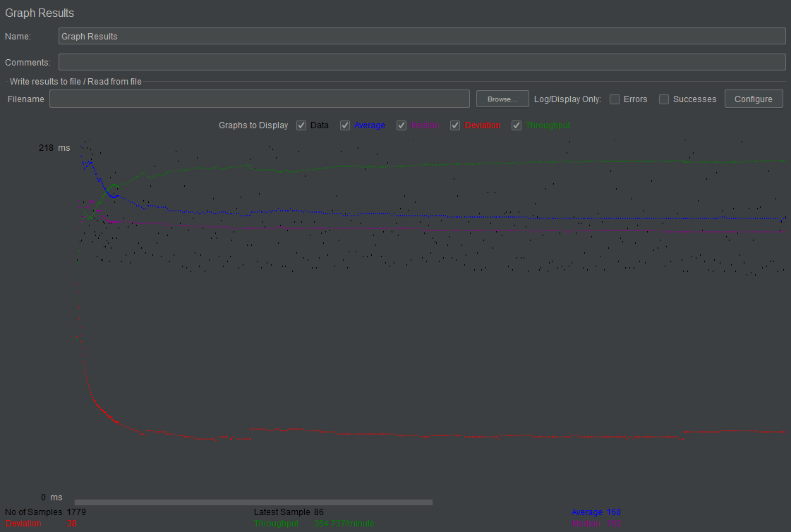
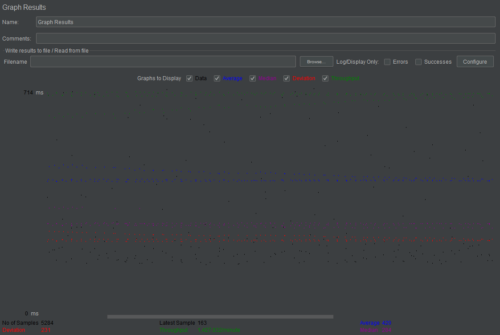
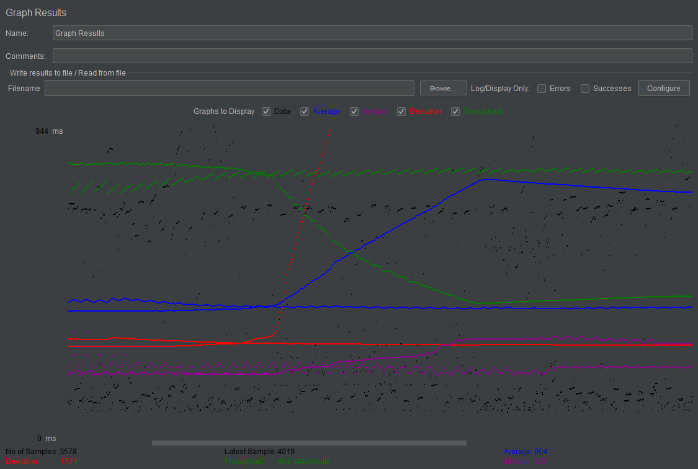
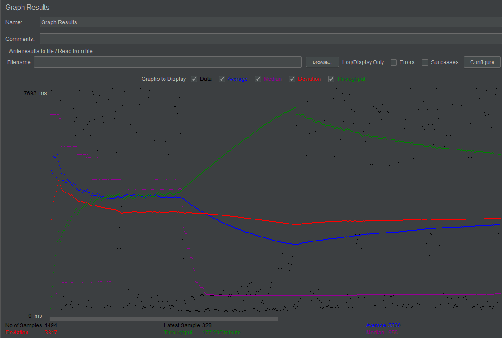
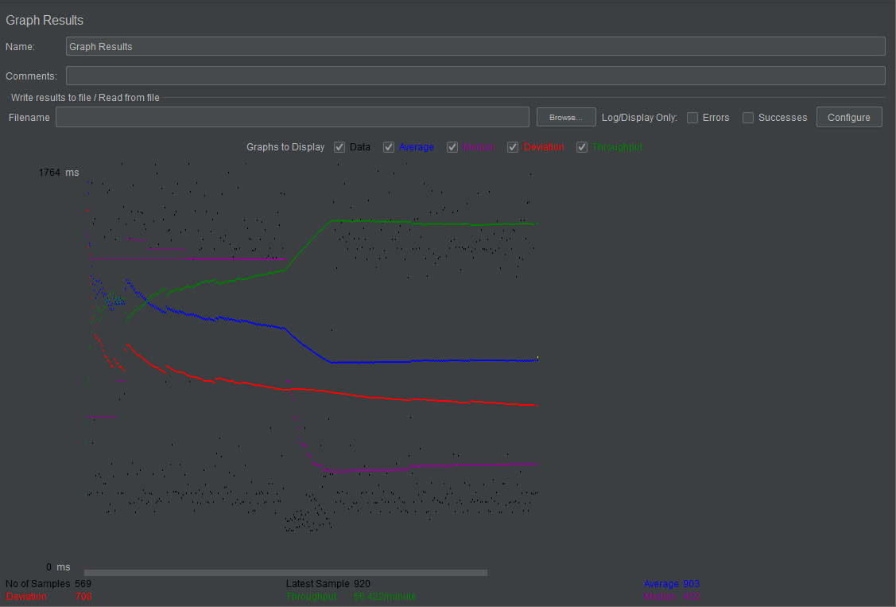
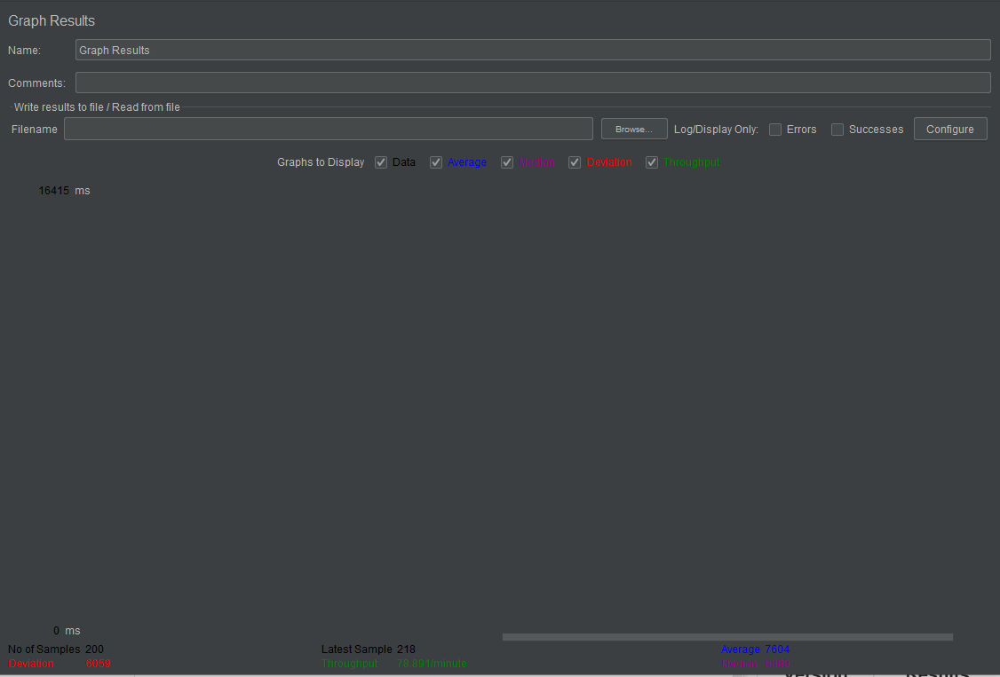
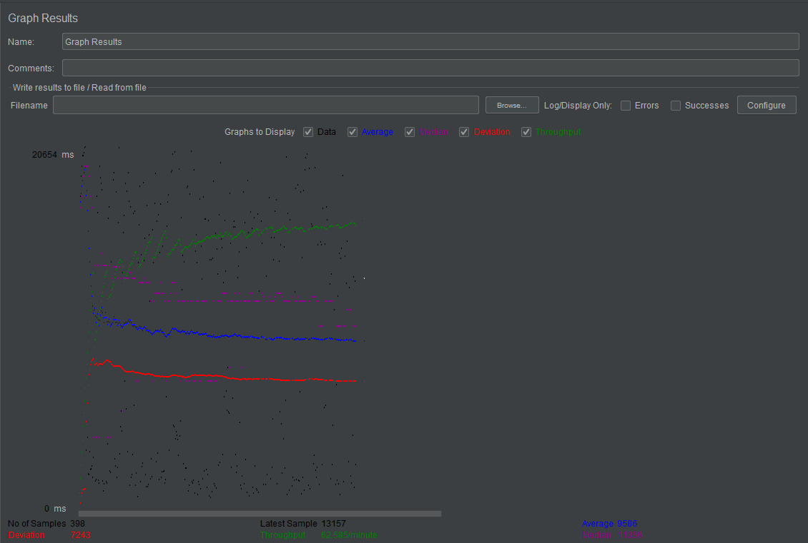

# FabFlix

Fabflix is a full stack web application that displays information on movies and stars.
Developers: Chan Woo Park, Sung Soo Kim
    

## **Demos**
    
- [Authentication, Search & Sorting, cart](https://youtu.be/_Wm3XJblF2s "Authentication, Search & Sorting, cart")
- [Full-text search](https://youtu.be/mOnUfLHXKDQ "Full-text search")
- [Android app Demo I](https://youtu.be/pu4MgbKMyYY "Android app Demo I")
- [Android app Demo II](https://youtu.be/CSyq0X2EUPs "Android app Demo II")
- [Master/slave servers, HTTP testing](https://youtu.be/KML-va-tUH8 "Master/slave servers, HTTP testing")
- [Deploy Tomcat & pages UI](https://youtu.be/ZovyHm_lWuY "Deploy Tomcat & pages UI")

## Instruction of deployment

1 ) Download source, or clone the git repository
```
git clone https://github.com/ChanwO-o/FabFlix.git
cd FabFlix
```

2 ) Install dependencies
```
mvn clean package
```

3 ) Export .war file & deploy to Tomcat
```
mv cs122b-spring20-team131.war ~/path-to-your-tomcat-installation/webapps
```

4 ) View app on browser: visit localhost:8080 to view running app in your browser.


# Connection Pooling
The following source/configuration files use JDBC connection pooling:
* web/src/CartServlet.java
* web/src/LoginServlet.java
* web/src/MainPageServlet.java
* web/src/MetadataServlet.java
* web/src/MovieListServlet.java
* web/src/SingleMovieServlet.java
* web/src/SingleStarServlet.java
    

Establishing connections to the database is a resource-heavy task, and thus connection pooling is used to reuse existing connections. Most servlets use Connection objects to communicate with the database. When required, a servlet calls the getConnection() method on the DataSource object.

With Connection Pooling activated, the following setup is made on the datasource object:
```
Context initContext = new InitialContext();
Context envContext = (Context) initContext.lookup("java:/comp/env");
dataSource = (DataSource) envContext.lookup("jdbc/moviedb");
```
This way, dataSource.getConnection() will now retrieve existing connections.

    
With two backend SQL instances:
- When executing reading operations, pooled Connections can work with either database instance (master or slave).
- When writing to the database, the connections must go to the master database.

# Master/Slave servers
The following source/configuration files handle routing of queries to Master/Slave SQL instances:
- web/src/PaymentServlet.java
- web/src/DashboardServlet.java

#### How read/write requests are routed to Master/Slave SQL
There is a second data source tag in the `context.xml` file that points to the master SQL instance.
As a result, context.xml contains two resource tags:
    
1. moviedb : allows load balancer to choose which SQL instance to redirect to
2. masterdb: always sends request to master SQL instance
    
For any read operations, either SQL instance can be used. This is because both instances are synced, and will provide the most updated data.
For write operations, the masterdb must be used. This is where I specified the masterdb data source in the two Servlets above.
    
```
Connection dbcon = masterDataSource.getConnection();
```

# JMeter TS/TJ Time Logs
#### How to use the `log_processing.py` script to process JMeter logs

1. Install python3

2. Edit `log_processing.py`. On line 2, change the variable filename to the name of your JMeter log file
```
filename = 'jmeter_log.txt'
```

3. Run the python script
```
python log_processing.py
```

4. The TJ and TS values of the log file will be displayed.

# JMeter TS/TJ Time Measurement Report

| **Single-instance Version Test Plan**          | **Graph Results Screenshot** | **Average Query Time(ms)** | **Average Search Servlet Time(ms)** | **Average JDBC Time(ms)** | **Analysis** |
|------------------------------------------------|------------------------------|----------------------------|-------------------------------------|---------------------------|--------------|
| Case 1: HTTP/1 thread                          |    | 168                        | 5.358938                            | 4.80465                   | Linear           |
| Case 2: HTTP/10 threads                        |    | 420                        | 29.58407                            | 26.57975                  | Linear           |
| Case 3: HTTPS/10 threads                       |    | 904                        | 47.101473                           | 41.631454                 | Average increases drastically           |
| Case 4: HTTP/10 threads/No connection pooling  |    | 3360                       | 98.188716                           | 91.848728                 | Average decreases           |

| **Scaled Version Test Plan**                   | **Graph Results Screenshot** | **Average Query Time(ms)** | **Average Search Servlet Time(ms)** | **Average JDBC Time(ms)** | **Analysis** |
|------------------------------------------------|------------------------------|----------------------------|-------------------------------------|---------------------------|--------------|
| Case 1: HTTP/1 thread                          |    | 903                        |     78.554848                             | 34.366108                        | Decreased average           |
| Case 2: HTTP/10 threads                        |    | 7604                         | 576.688429                                  | 244.700625                        | Error           |
| Case 3: HTTP/10 threads/No connection pooling  |    | 9586                       | 855.783953                          | 572.586797                | Linear           |
